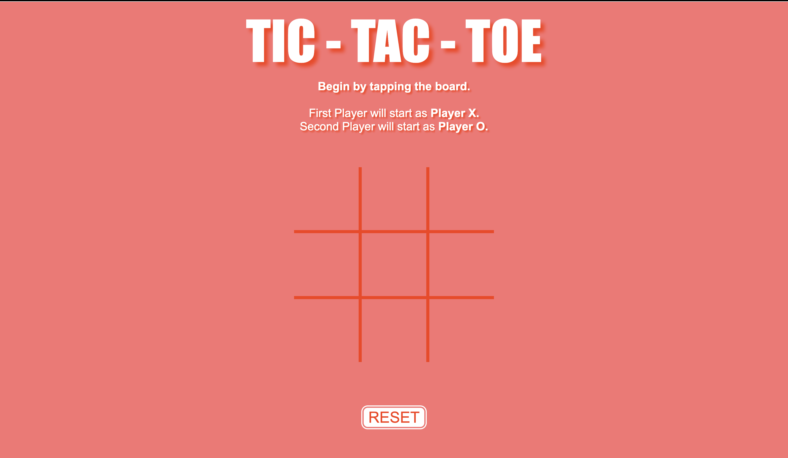
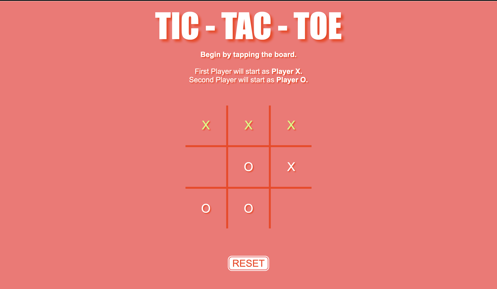

# Tic-Tac-Toe Game

## Objective:
The objective for this project was to design a simple, two player Tic-Tac-Toe game using HTML, CSS, and Javascript. 

## Game Description:
In this friendly match-up between two players, the purpose of Tic-Tac-Toe is to be the first to get three X's or three O's in a row (horizontally or vertically). 

Player 1 will always be X's, while Player 2 will always be O's. 

## Game Rules:
1. Decide which player will be player 1, and who will be player 2.

2. Player 1 will go first and will be assigned X's. Player 2 will be assigned O's.

3. Player 1 and Player 2 will take turns going back and forth by clicking a square in the Tic-Tac-Toe grid.

4. The first player to get three X's or three O's in a row, wins! 

5. If all 9 squares in the grid have been used, and no one was able to get three X's or three O's in a row, then the game ends in a tie.

6. Use the reset button at the bottom to clear the board and play again.

#

Link to deployed application: https://lizf57.github.io/tic-tac-toe/

